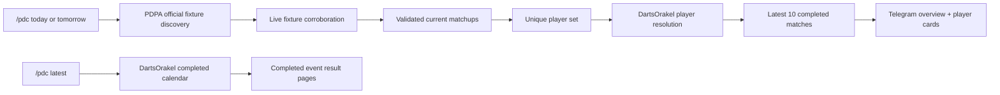

# PDC upcoming-match failure analysis and architecture

## What failed

`/pdc tomorrow` used the completed-tournament path:

1. load DartsOrakel calendar rows;
2. discard every row whose `winnerName` is `null`;
3. fetch the surviving event's completed result page.

That invariant is correct for `/pdc latest`, but impossible for tomorrow: a future event cannot already have a winner or completed result page. The empty response in Telegram was therefore deterministic application behavior, not proof that the calendar had no event. Tests only covered completed rows, so the mismatch between the command label and its data contract escaped.

## New separation of responsibilities

- **PDPA establishes official-event truth.** The fixture adapter reads the public full calendar, considers recent candidate events, then parses only the requested day's concrete `Player A v Player B` rows from official event details.
- **The live preview owns last-minute changes.** A live row may replace PDPA participants or supply a start time only when it shares at least one normalized player with exactly one unused official fixture. Unrelated MODUS/WDF rows cannot enter the PDC report.
- **DartsOrakel owns historical form.** Each scheduled name is resolved against its player directory before bounded recent-history retrieval.
- **The application owns orchestration.** Fixtures and player form have different schemas, caching, failure policy, and freshness. They are joined only in `PdcTournamentService`.
- **`/pdc latest` remains a completed-results operation.** Upcoming behavior no longer weakens the completed-event invariant.

## Reliability decisions

1. All external HTML/JSON is normalized and schema-validated before use.
2. Only HTTPS `pdpa.co.uk` fixture URLs and the existing trusted DartsOrakel transport are accepted.
3. Fixtures are deduplicated by date and normalized player pair; players are deduplicated before history work.
4. Player lookups are bounded to four concurrent jobs and one canonical statistics view per player.
5. Bulk mode loads all three DartsOrakel views (average, 180s, and checkout percentage) for every player. Request starts are serialized and paced below the public Reader transport's rolling allowance, with bounded retries for transient failures. Upcoming scans are registered with Vercel `waitUntil`, so Telegram receives its acknowledgement immediately while the complete 16-player research job continues in the background. A source metric missing from an individual match is omitted (`undefined`) rather than represented as a misleading zero or `null`.
6. One player failure does not erase the fixture card; it is surfaced next to that player. The live smoke test is stricter and fails unless every scheduled player has history.
7. Fixture snapshots cache for five minutes; completed calendars keep their independent 30-second cache.
8. The fixture cache version is bumped whenever source reconciliation changes, preventing a previously cached stale draw from surviving a deployment.

## Feynman walkthrough

Think of the old bot as checking tomorrow's cinema listings by looking in yesterday's box-office receipts. A receipt has a winner/score, so the code rejected anything that had not happened. The new bot first reads the official programme to learn **who is scheduled**, then asks the statistics source **what each named player did in their last ten completed matches**. These are separate questions, answered by separate sources, and joined only after both answers are validated.

## Verification contract

- Unit tests prove calendar/detail parsing, requested-day filtering, placeholder rejection, unique-player expansion, command routing, and public error handling.
- `npm run build` proves strict TypeScript compatibility.
- `npm test` covers the entire repository.
- `npm run pdc:upcoming:smoke` proves the live tomorrow path without sending Telegram messages and reports fixture/player source URLs plus message-size evidence.
