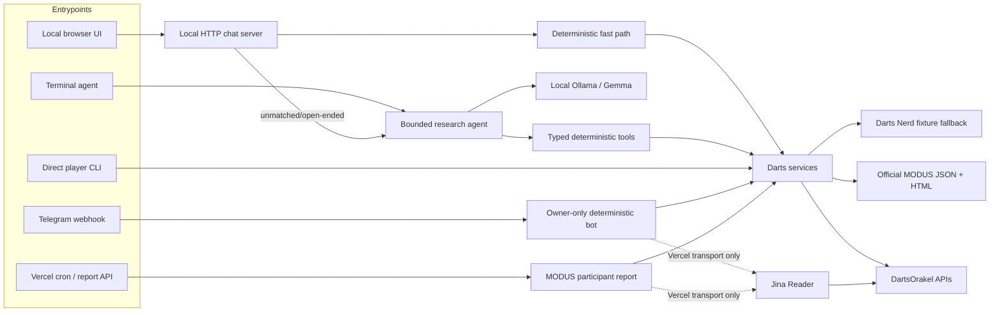
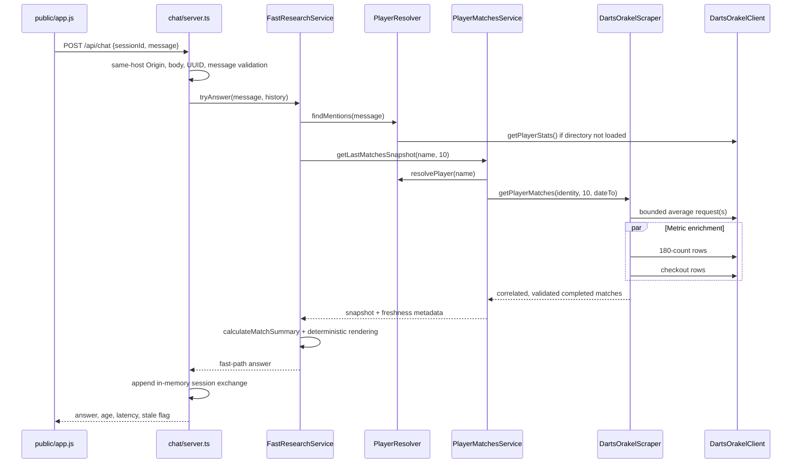

# Repository Walkthrough

> Evidence snapshot: local checkout of `https://github.com/vse1999/dartsscraper`, branch `master`, commit `6b57e2bee8a56e96ec4907433291a3b5bf68384d`. This walkthrough follows **code > config > tests > existing docs**. Live upstreams and deployed Vercel/Telegram settings were not exercised; where the repository cannot prove operational state, this document says so.

## Product and Primary Use Cases

This repository is an evidence-first darts statistics system, not one monolithic chatbot. It exposes the same deterministic data core through several runtimes:

1. **Direct player research:** resolve an exact DartsOrakel player and show recent completed matches, three-dart averages, 180 counts, checkout conversion, form, and coverage.
2. **Local browser research:** answer common factual questions without a model and use local Ollama/Gemma for unmatched/open-ended requests. The **terminal agent** always uses the Ollama tool loop; the separate direct player CLI bypasses the LLM.
3. **Private Telegram bot:** let one configured owner request last-N player statistics. An explicit `from MODUS` uses official MODUS history; an unqualified request uses DartsOrakel.
4. **MODUS reporting:** discover today's or tomorrow's scheduled MODUS players and send a Telegram dashboard of their recent **DartsOrakel form**. This is different from the local chatbot's official current-MODUS results view.
5. **Source-level API and maintenance tools:** use the in-repository TypeScript barrel in [`src/index.ts`](../src/index.ts), refresh the committed MODUS catalogue, or run live smoke scripts. The private package has no `main`/`exports` and emits no JavaScript, so it is not currently a published/consumable npm library.

There is no database, hosted LLM, Telegram long-polling process, Redis, durable queue, or general web search implementation.

## The Mental Model



The central design rule is: **models may interpret and explain, but TypeScript owns retrieval, parsing, calculations, and source routing**. Dates, network calls, player identity, source parsing, aggregation, freshness, and safety limits are deterministic. Final-prose evidence enforcement is strong but specialized rather than universal; see Deterministic Logic vs LLM Responsibilities.

## Architecture and Major Modules

| Layer | Responsibility | Key implementation |
|---|---|---|
| Composition/public API | Constructs local runtime dependencies and exports reusable types/services | [`src/agent/factory.ts`](../src/agent/factory.ts) `createDartsResearchRuntime`; [`src/index.ts`](../src/index.ts) |
| DartsOrakel transport | Builds API URLs, applies request pacing/timeouts/retries, validates JSON, optionally caches raw responses | [`src/dartsorakel/client.ts`](../src/dartsorakel/client.ts) `DartsOrakelClient`; [`src/dartsorakel/selectors.ts`](../src/dartsorakel/selectors.ts) |
| DartsOrakel extraction | Expands recent-history windows, fetches three metric views, filters and correlates rows safely | [`src/dartsorakel/scraper.ts`](../src/dartsorakel/scraper.ts) `DartsOrakelScraper`; [`src/dartsorakel/parser.ts`](../src/dartsorakel/parser.ts) |
| Player identity | Builds a DartsOrakel directory; resolves only unique normalized exact names; finds names in prose | [`src/player/resolver.ts`](../src/player/resolver.ts) `PlayerResolver` |
| Player application service | Combines identity and scraping behind single-flight, stale-while-revalidate snapshots | [`src/services/player-matches.ts`](../src/services/player-matches.ts) `PlayerMatchesService`; [`src/services/snapshot-store.ts`](../src/services/snapshot-store.ts) |
| Statistics | Computes record, mean/best average, complete-only 180 total, weighted checkout rate, and coverage | [`src/services/statistics.ts`](../src/services/statistics.ts) `calculateMatchSummary` |
| Current MODUS results | Joins official daily feed, results-page context/cross-check, and weekly-average page | [`src/modus/official-results-source.ts`](../src/modus/official-results-source.ts) `OfficialModusResultsSource`; [`src/modus/results-service.ts`](../src/modus/results-service.ts) |
| MODUS participant discovery | Ordered official-feed then Darts Nerd adapters; resolves abbreviated fixture names | [`src/modus/service.ts`](../src/modus/service.ts) `ModusPlayersService`; [`src/modus/official-source.ts`](../src/modus/official-source.ts); [`src/modus/darts-nerd-source.ts`](../src/modus/darts-nerd-source.ts) |
| Historical MODUS | Uses committed official index plus live catalogue overlay, then verifies official detail pages | [`src/modus/player-history-service.ts`](../src/modus/player-history-service.ts); [`src/modus/history-source.ts`](../src/modus/history-source.ts); [`data/modus-results-index.json`](../data/modus-results-index.json) |
| Fast local answers | Recognizes a small factual intent set and renders source-backed answers without Ollama | [`src/services/fast-research.ts`](../src/services/fast-research.ts) `FastResearchService` |
| LLM orchestration | Runs a bounded tool loop, guards source/date choices, validates selected high-risk evidence, and repairs/replaces protected answer shapes | [`src/agent/harness.ts`](../src/agent/harness.ts) `DartsResearchAgent` |
| Tool boundary | Defines five callable tools, validates arguments, and consumes schema-validated service results | [`src/agent/tools.ts`](../src/agent/tools.ts) `AGENT_TOOL_DEFINITIONS`, `DartsAgentToolExecutor` |
| Ollama integration | Calls `/api/chat`; supports native tools and a schema-constrained JSON fallback | [`src/agent/ollama-client.ts`](../src/agent/ollama-client.ts) `OllamaClient` |
| Local web app | Same-origin Node HTTP API, sessions, health, static UI, browser persistence and safe rendering | [`src/chat/server.ts`](../src/chat/server.ts); [`public/app.js`](../public/app.js) |
| Telegram/Vercel | Authenticated webhook, owner guard, query routing, formatting, report trigger and cron report | [`api/telegram-webhook.ts`](../api/telegram-webhook.ts); [`src/telegram/bot.ts`](../src/telegram/bot.ts); [`api/daily-modus-report.ts`](../api/daily-modus-report.ts) |

### Domain objects worth knowing

- `PlayerIdentity`: DartsOrakel `id`, canonical `name`, and profile `slug` in [`src/schemas/player.ts`](../src/schemas/player.ts).
- `Match`: normalized completed-match row, with optional/null metric fields, in [`src/schemas/match.ts`](../src/schemas/match.ts).
- `MatchSummary`: derived aggregate and coverage fields in [`src/services/statistics.ts`](../src/services/statistics.ts).
- `ModusResultsSnapshot`: current official daily matches, selected series/week/group, weekly averages, timestamps, sources, and warnings in [`src/modus/results-schemas.ts`](../src/modus/results-schemas.ts).
- `ModusResultsIndex`: generated catalogue of official match references in [`src/modus/history-schemas.ts`](../src/modus/history-schemas.ts).

## All Runtimes and Entry Points

| Entry point | Invocation | Behavior |
|---|---|---|
| [`src/cli.ts`](../src/cli.ts) `main` | `npm run player -- "Damon Heta" 10 [--json]` | Direct deterministic DartsOrakel CLI; uses `.cache/dartsorakel`. |
| [`src/agent-cli.ts`](../src/agent-cli.ts) `main` | `npm run agent -- [--debug] [--model name] [query]` | One-shot or interactive LLM agent; retains at most 20 history messages in the process. It does **not** use the browser fast path. |
| [`src/chat-server.ts`](../src/chat-server.ts) `main` | `npm run chat` | Validates chat/Ollama environment, preloads the fast path, and listens on `127.0.0.1:3210` by default. |
| [`public/app.js`](../public/app.js) | Served by the chat server | Browser transcript/session UUID in `localStorage`, health polling, send/cancel/clear, safe table/text rendering. |
| [`start-chatbot.cmd`](../start-chatbot.cmd) → [`start-chatbot.ps1`](../start-chatbot.ps1) | Double-click or run in PowerShell | Starts Ollama if needed, pulls and warms the model, starts chat, then opens a browser. It does not install npm dependencies. |
| [`api/telegram-webhook.ts`](../api/telegram-webhook.ts) default `fetch` | Vercel `/api/telegram-webhook` | Authenticates and bounds a Telegram update, lazily initializes grammY, waits for update processing, then acknowledges. |
| [`api/daily-modus-report.ts`](../api/daily-modus-report.ts) default `fetch` | Vercel cron or authenticated GET | Runs `today`/`tomorrow` participant-form report; defaults to tomorrow. |
| [`vercel.json`](../vercel.json) cron | `0 17 * * *` | Calls `/api/daily-modus-report`; both API functions have a 180-second limit. Cron time is UTC. |
| [`scripts/refresh-modus-index.ts`](../scripts/refresh-modus-index.ts) | `npm run modus:index` | Rewrites the committed MODUS historical index from official pages. |
| [`scripts/telegram-smoke.ts`](../scripts/telegram-smoke.ts) | `npm run telegram:smoke` | Loads `.env.local`, sends a synthetic owner update, and performs real Telegram delivery/edit. |
| [`scripts/modus-all-players-smoke.ts`](../scripts/modus-all-players-smoke.ts) | `npm run modus:players:smoke` | Live official-history validation for every current MODUS player, sequentially. |
| [`scripts/modus-smoke.ts`](../scripts/modus-smoke.ts) | `npm run modus:smoke -- "Player" 10` | Intended single-player official MODUS smoke, but currently contradicts the router; see Technical Debt. |
| [`src/index.ts`](../src/index.ts) | Imported by in-repo/TypeScript source consumers | Source-level barrel, not a process or built/published JavaScript package. |
| [`.github/workflows/ci.yml`](../.github/workflows/ci.yml) | Push, pull request, manual dispatch | Locked install, type-check, tests, production dependency audit on Node 24. |

## Source-of-Truth Rules

“MODUS data” refers to three different products. Do not collapse them.

| Question/data | Source of truth | Fallback/merge rule |
|---|---|---|
| Current/today/latest MODUS matches, scores, statuses, per-match averages | Official `live-scores-json.php` via `OfficialModusResultsSource.getResults` | Requested date must equal feed date. Missing averages stay `null`. Never replace with DartsOrakel. |
| Current MODUS series/week/group context | Official `results.php` | Its fixture cards must contain every daily-feed matchup; mismatch fails the whole snapshot. |
| Official cumulative weekly average | Official `week-averages.php` | The reported value is retained after verification against `(points / darts) * 3` within a 0.02 tolerance; inconsistency fails. |
| MODUS players/fixtures only | `OfficialModusSource`, then `DartsNerdModusSource` | First non-empty validated source wins; results are not merged. DartsOrakel resolves abbreviations but is not the fixture source. |
| Explicit Telegram `from MODUS` player history | Bundled official index + live official catalogue; official `match-db-stats.php` for each row | Live reference replaces bundled reference with the same `matchId`. Detail page must match players/series/week/group. No DartsOrakel fallback. |
| Unqualified or explicit DartsOrakel last-N history | DartsOrakel `/api/stats/player` and `/api/player/matches/:id` | In Telegram, `auto` means DartsOrakel; it is not automatic provider failover. |
| MODUS daily Telegram dashboard | MODUS sources for participant list; DartsOrakel for form metrics | Deliberately a cross-source report. Header states that form is last-N DartsOrakel matches. |
| LLM factual evidence | Successful deterministic tool output from the current run | Prior assistant prose is context, never evidence. Harness validators or deterministic formatters supersede unsupported model prose. |

### DartsOrakel row rules

[`DartsOrakelScraper.getRecentPlayerMatches`](../src/dartsorakel/scraper.ts) requests average rows over 90, 180, 365, then 730 days and finally full history until it can satisfy the limit. The final range is enriched with parallel requests for 180s and checkout statistics. [`parseDartsOrakelMatchesWithStatistics`](../src/dartsorakel/parser.ts) treats average rows as canonical and joins other metrics only when the correlation group is one-to-one. Missing or ambiguous enrichment remains unavailable; it is never joined by array position. Byes and incomplete results are excluded.

`Jina Reader` is a transport, not a data source. The Vercel-facing DartsOrakel clients wrap public DartsOrakel HTTPS GETs through [`createJinaReaderFetch`](../src/dartsorakel/reader-fetch.ts) because the repository records that direct Vercel traffic is challenged. Local CLI/chat runtimes fetch DartsOrakel directly.

## End-to-End Workflows

### Typical local player query

Example: `Show Rob Cross's last 10 matches and calculate his match average.`



Exact call chain:

1. [`public/app.js`](../public/app.js) `sendMessage` posts strict JSON to `/api/chat`.
2. [`src/chat/server.ts`](../src/chat/server.ts) `routeRequest`/`handleChat` applies a same-host `Origin` check, validates the request, and reads bounded session history.
3. [`src/services/fast-research.ts`](../src/services/fast-research.ts) `tryAnswer`/`resolveIntent` recognizes a single-player last-N request.
4. [`src/player/resolver.ts`](../src/player/resolver.ts) `findMentions` uses the DartsOrakel player directory; [`PlayerMatchesService.getLastMatchesSnapshot`](../src/services/player-matches.ts) owns the result snapshot.
5. `loadMatches` resolves the exact identity and calls `DartsOrakelScraper.getPlayerMatches`.
6. The scraper expands the date window, fetches the three statistic views, and [`src/dartsorakel/parser.ts`](../src/dartsorakel/parser.ts) validates/correlates them.
7. [`calculateMatchSummary`](../src/services/statistics.ts) computes deterministic totals and coverage; `renderPlayerMatches` builds the answer.
8. The server stores the exchange in [`ChatSessionStore`](../src/chat/session-store.ts) and returns `executionMode: "fast-path"`. The browser renders with DOM nodes/text, not `innerHTML`.

If a recognized fast-path source call fails, `tryFastAnswer` returns HTTP 502. It does **not** fall back to Gemma and risk a plausible but unverified answer.

### Open-ended local query and Ollama/Gemma

Queries with terms such as explain/why/how/compare/predict, or otherwise outside the small fast-intent set, return `null` from `FastResearchService.resolveIntent`. Then [`handleChat`](../src/chat/server.ts):

1. acquires the default one-request `RequestGate`;
2. verifies Ollama and the exact configured model through [`createOllamaHealthChecker`](../src/chat/ollama-health.ts);
3. calls [`DartsResearchAgent.run`](../src/agent/harness.ts);
4. sends a system prompt, bounded history, query, and five tool definitions to [`OllamaClient.chat`](../src/agent/ollama-client.ts);
5. validates requested arguments in [`DartsAgentToolExecutor.execute`](../src/agent/tools.ts);
6. runs independent new calls with concurrency three, reuses completed calls, and records evidence;
7. validates protected high-risk answer shapes. After bounded repair attempts, deterministic builders replace incomplete or contradictory current-MODUS, MODUS-average-batch, or requested match-row prose. Other open-ended final prose has no universal claim-to-evidence validator.

Agent defaults are 20 iterations, 32 tool calls, and 180 seconds. Each Ollama call defaults to a 90-second timeout, temperature 0, `think: false`, and `keep_alive: 30m`. Native tool calling is tried first. Only an HTTP 400 stating the model does not support tools switches that `OllamaClient` instance to its schema-constrained JSON action protocol.

### Telegram player query

```text
Telegram POST
  -> api/telegram-webhook.ts:handleTelegramWebhook
     -> method + constant-time webhook secret + 64 KiB + update_id checks
     -> processProductionUpdate / bot.handleUpdate
  -> src/telegram/bot.ts:createBot owner/private-chat middleware
  -> handleStatsText -> telegram/query.ts:parseStatsQuery
  -> send "Looking up completed matches..."
  -> SourceRoutedPlayerStatsService.getPlayerStats
     -> auto/dartsorakel: DartsPlayerStatsService
        -> PlayerMatchesService -> DartsOrakel through Jina Reader
     -> explicit modus: ModusPlayerHistoryService
        -> bundled + live official catalogue -> official match details
  -> telegram/formatter.ts:formatPlayerStats
  -> edit status message; if edit fails, send a new message
```

The first grammY middleware is the authorization boundary: updates not from `ALLOWED_USER_ID` in that user's private chat are silently dropped before commands, replies, or source calls. Telegram is fully deterministic and never constructs an Ollama client.

### `/modus` and scheduled daily report

[`parseModusReportCommand`](../src/telegram/modus-command.ts) accepts `today` or `tomorrow` and defaults to tomorrow. [`createHttpModusReportTrigger`](../src/telegram/modus-trigger.ts) calls the authenticated report endpoint; under Vercel the webhook hands this promise to `waitUntil`.

```text
/modus [today|tomorrow] OR Vercel cron at 17:00 UTC
  -> GET /api/daily-modus-report?date=... with Bearer CRON_SECRET
  -> api/daily-modus-report.ts:executeProductionReport
  -> resolve Budapest date
  -> ModusPlayersService: official daily feed, then Darts Nerd fallback
  -> runModusReport, concurrency 3
     -> for every player: last 10 DartsOrakel matches through Jina
     -> calculate deterministic form metrics
  -> formatModusOverviewMessages
  -> Telegram sendMessage; attach two-column player keyboard to last message
  -> callback recovers the player from Telegram's keyboard markup
  -> explicit DartsOrakel detail lookup
```

The callback payload stores only index and match count. [`resolveModusPlayerCallback`](../src/telegram/modus-player-callback.ts) verifies it against Telegram's copy of the originating keyboard, so no server-side callback session is required.

## Deterministic Logic vs LLM Responsibilities

| Deterministic TypeScript owns | Gemma owns |
|---|---|
| Date parsing and Budapest timezone | Interpreting open-ended wording |
| Provider/source precedence | Selecting among registered tools when no fast path matches |
| All HTTP requests and allowed URL construction | Synthesizing or explaining validated tool evidence |
| Player identity, HTML/JSON parsing and status mapping | Response wording for non-fast-path requests |
| Match deduplication/correlation |  |
| Means, record, 180 totals, weighted checkout, weekly-average verification |  |
| Cache freshness and fallback limits |  |
| Zod schemas, request bounds and typed errors |  |
| Current-MODUS routing guard and specialized evidence checks/fallback answers |  |

The model has no arbitrary fetch, browser, shell, or calculator tool. The prompt in `DartsResearchAgent.systemPrompt` explicitly says not to invent or recalculate facts. Current MODUS requests are pre-routed to `getModusResults`; the model cannot substitute old per-player DartsOrakel form for the official slate. Mechanical final-answer validation/fallback covers official current-MODUS snapshots, MODUS average batches, and requested match-row answers; generic fixture/date/open-ended prose relies on the prompt and returned tool evidence.

## Caching and Freshness

| Cache | Policy | Runtime scope |
|---|---|---|
| [`FileCache`](../src/cache.ts) | SHA-256 filenames, expiry envelope, temp-file + rename write; corrupt/expired reads miss; write failures are non-fatal | Local filesystem; `.cache/` is ignored |
| Raw DartsOrakel player directory | 30-day TTL | Local CLI/agent file cache when configured |
| Raw DartsOrakel match HTTP response | 10-second TTL, keyed by player/date/stat/filter/limit | Local CLI/agent file cache when configured |
| `PlayerResolver.directoryPromise` | One successful directory for process lifetime; failed load clears | In memory; can outlive disk TTL in a long process |
| Player result snapshot | Fresh 15s; stale-while-revalidate through 5m; shared in-flight load; max 500 request keys | In memory, keyed by normalized player + limit + next Budapest date |
| MODUS current result snapshot | Fresh 10s; max stale 5m; active date refresh every 10s; max 8 dates | In memory |
| MODUS current disk fallback | File TTL 5m and embedded `fetchedAt` rejected after 5m; read once per date/process | `.cache/modus-results`, local agent/chat only |
| MODUS fixture discovery | Today 30s; all other dates, including tomorrow, 6h | `.cache/modus`, local agent/chat only |
| MODUS live historical catalogue | Success 30s; failed live refresh falls back to bundled index for 15s | Warm Telegram process |
| MODUS match details | Promise cache, max 1,000 LRU-like entries, no TTL; failures removed | Warm Telegram process |
| Chat server sessions | 6h inactivity, max 100 sessions, 20 messages and 32,000 characters each | Process memory only |
| Browser transcript | 20 messages, 40,000 characters | Browser `localStorage` |
| Ollama health | 5 seconds | Process memory |

The local factory configures `.cache/dartsorakel`, `.cache/modus`, and `.cache/modus-results`; directories are created lazily on writes. Vercel uses no disk cache. The Telegram webhook may retain service caches on a warm instance through its module-level bot singleton; the daily-report endpoint rebuilds its service graph per invocation, so its caches are execution-local. Official MODUS result requests themselves use `cache: "no-store"`.

## Validation, Errors, and Security

### Validation and integrity

- TypeScript uses `strict`, `noUncheckedIndexedAccess`, `exactOptionalPropertyTypes`, and no emit in [`tsconfig.json`](../tsconfig.json).
- Zod validates player/match objects, tool arguments, dates, MODUS snapshots/history, Ollama responses, JSON fallback actions, environment, and inbound chat bodies.
- Checkout percentage is recomputed from raw hits/attempts; inconsistent values fail in [`src/dartsorakel/parser.ts`](../src/dartsorakel/parser.ts) and [`src/schemas/match.ts`](../src/schemas/match.ts).
- A 180 total is published only when every selected row has the metric. Checkout is weighted by aggregate hits/attempts, not averaged from displayed percentages.
- Extracted historical MODUS URLs are pinned to official host/path and matched back to catalogue identity/context.
- Missing source values render as `—`; providers are not blended to fill gaps.

### Error and availability behavior

- [`src/errors.ts`](../src/errors.ts) separates player-not-found/ambiguous, request, source-structure, insufficient-data, MODUS history, agent-limit, and Ollama errors.
- Default local DartsOrakel requests use a 15s timeout, two retries, linear backoff from 300ms, `Retry-After`, and 250ms minimum start cadence. Among HTTP responses, 408, 429, and 5xx are retryable; transport/network failures are also retried, while other HTTP statuses fail immediately.
- Interactive Telegram DartsOrakel uses zero retries for latency. Daily automation uses two retries, a 3s backoff, and 3s request-start cadence for Jina throttling.
- Telegram converts typed source errors to sanitized user messages. If status editing fails it sends a fresh message; if final delivery also fails, the webhook returns 503 so Telegram can retry.
- Chat maps busy model work to 429, Ollama/source failures to 502/503, safety limits to 504, and unexpected failures to sanitized 500 responses.
- Cache errors degrade to live/uncached behavior rather than failing the request.

### Security boundaries

**Telegram/Vercel:**

- `WEBHOOK_SECRET` and `CRON_SECRET` require 32–256 allowed characters and are compared with `timingSafeEqual`.
- Wrong webhook method/secret returns 404; the webhook bounds declared and actual bodies to 64 KiB.
- Bot token and owner ID formats are validated. The owner/private-chat middleware runs first.
- The webhook does not require a JSON `Content-Type`; before grammY, it validates only a root object and nonnegative safe `update_id`. Nested Telegram update validation is delegated to grammY.
- The Jina adapter permits only HTTPS GET requests to the exact DartsOrakel origin; Telegram token, identity, and message are not sent to Jina.
- Secrets live in environment variables. `.env*` is ignored except `.env.example`, and Vercel packaging excludes environment files.

**Local chatbot:**

- Default binding is loopback. The API compares the `Origin` host with the `Host` header, bounds bodies to 16 KiB, requires JSON, validates UUID/message, and emits CSP, COOP, CORP, no-referrer, no-sniff, and frame-denial headers. This is a same-host check, not a full scheme-aware same-origin policy.
- Static paths are allowlisted. Browser answer rendering uses text nodes and controlled element creation rather than `innerHTML`.
- There is no application authentication or TLS. Requests without an `Origin` header are allowed. Keep `CHAT_HOST=127.0.0.1`; exposing it requires authentication, network controls, rate limiting, and TLS.
- Browser transcripts are plaintext in `localStorage`; backend conversation history is plaintext process memory.
- `OLLAMA_BASE_URL` accepts HTTP or HTTPS. “Inference stays local” is guaranteed only by keeping the default local URL.

## Environment and Configuration

| Variable | Required/default | Consumers and notes |
|---|---|---|
| `BOT_TOKEN` | Required for Telegram/report | Validated BotFather-style token in `readBotConfiguration`; secret. |
| `ALLOWED_USER_ID` | Required for Telegram/report | Positive safe integer; both authorization identity and report chat destination. |
| `WEBHOOK_SECRET` | Required by webhook | Must match Telegram webhook `secret_token`. |
| `CRON_SECRET` | Required by report; needed to enable `/modus` | Bearer secret for `/api/daily-modus-report`. |
| `MODUS_REPORT_URL` | Optional | Explicit report endpoint used by `/modus`. |
| `VERCEL_PROJECT_PRODUCTION_URL` | Platform-provided optional fallback | Builds stable production report URL; per-deployment URL is intentionally not used. |
| `OLLAMA_MODEL` | `gemma4:12b` | Browser chat and terminal agent model. |
| `OLLAMA_BASE_URL` | `http://127.0.0.1:11434` | Browser chat/health. **Terminal `npm run agent` currently does not forward this env override.** |
| `OLLAMA_KEEP_ALIVE` | `30m` | Browser chat. Accepts `-1`, `0`, or numeric `ms/s/m/h`. **Terminal agent does not forward this env override.** |
| `CHAT_HOST` | `127.0.0.1` | Local listener; do not broaden casually. |
| `CHAT_PORT` | `3210` | Integer 1–65535 in the executable environment schema. |

The application does not automatically load `.env` files. Export variables in the shell or use Vercel settings. `scripts/telegram-smoke.ts` is the exception: it explicitly loads `.env.local`.

Configuration sources:

- [`package.json`](../package.json): ESM package, scripts, Node `24.x`, runtime dependencies.
- [`tsconfig.json`](../tsconfig.json): strict compile contract.
- [`vercel.json`](../vercel.json): functions, durations, cron.
- [`.vercelignore`](../.vercelignore): excludes tests, scripts, env, cache, coverage, logs.
- [`.env.example`](../.env.example): supported environment names/defaults, not automatic loading.

## Testing, CI, and Deployment

### Test strategy

The suite is Vitest with injected fetches, source-shaped fixtures, and a real loopback HTTP server for chat tests.

| Area | Representative tests |
|---|---|
| Agent bounds, tool planning, repair/fallback, JSON protocol | [`tests/agent-harness.test.ts`](../tests/agent-harness.test.ts), [`tests/agent-tools.test.ts`](../tests/agent-tools.test.ts) |
| Chat HTTP, sessions, health, fast path | [`tests/chat-server.test.ts`](../tests/chat-server.test.ts), [`tests/chat-session-store.test.ts`](../tests/chat-session-store.test.ts), [`tests/ollama-health.test.ts`](../tests/ollama-health.test.ts) |
| DartsOrakel transport/parser/resolution/history | [`tests/client.test.ts`](../tests/client.test.ts), [`tests/parser.test.ts`](../tests/parser.test.ts), [`tests/resolver.test.ts`](../tests/resolver.test.ts), [`tests/recent-player-matches.test.ts`](../tests/recent-player-matches.test.ts) |
| MODUS current/history/cache/report | [`tests/modus-results.test.ts`](../tests/modus-results.test.ts), [`tests/modus-history.test.ts`](../tests/modus-history.test.ts), [`tests/modus-report.test.ts`](../tests/modus-report.test.ts) |
| Telegram auth/query/delivery/webhook | [`tests/telegram.test.ts`](../tests/telegram.test.ts), [`tests/telegram-webhook.test.ts`](../tests/telegram-webhook.test.ts), [`tests/telegram-sender.test.ts`](../tests/telegram-sender.test.ts) |
| Cache/snapshot/statistics | [`tests/cache.test.ts`](../tests/cache.test.ts), [`tests/snapshot-store.test.ts`](../tests/snapshot-store.test.ts), [`tests/statistics.test.ts`](../tests/statistics.test.ts) |

Validation on the inspected snapshot:

- `npm run build`: passed.
- `npm test`: 29 files and 223 tests passed.
- `npm run audit:prod`: 0 production vulnerabilities reported by npm audit.

Normal CI does **not** verify live DartsOrakel/Jina/MODUS/Telegram behavior, browser behavior through an actual browser, PowerShell launch, CLI integration, Vercel bundling/cron, or webhook registration. There is no lint, formatting, or coverage threshold. `tests/cache.test.ts` has only one direct file-cache test.

### CI

[`.github/workflows/ci.yml`](../.github/workflows/ci.yml) runs on push, pull request, and manual dispatch with read-only repository permission and a ten-minute timeout:

1. `actions/checkout@v7`
2. `actions/setup-node@v6`, Node 24, npm cache
3. `npm ci`
4. `npm run build`
5. `npm test`
6. `npm run audit:prod`

The actions use floating major tags rather than commit SHAs. The production audit intentionally excludes dev dependencies.

### Vercel deployment

- Two Node-dependent handlers use default `fetch` exports: Telegram webhook and daily report. No explicit Vercel runtime declaration is committed; `package.json` declares Node 24.x.
- Both source files and `vercel.json` declare 180-second durations, which duplicates configuration.
- The report trigger times out after 170 seconds, leaving roughly ten seconds below the configured function limit.
- Cron is `17:00 UTC`; `executeProductionReport` resolves the default `tomorrow` in `Europe/Budapest`.
- Webhook registration, project linkage, environment values, deployment protection, and production monitoring are external/manual and cannot be verified from the repository.
- The daily endpoint returns HTTP 200 and `ok: true` even when `failed > 0` or fixture discovery fails. Monitoring only HTTP status will miss degraded reports.

## Where to Modify Common Features

| Change | Primary files | Also update/verify |
|---|---|---|
| Add/change DartsOrakel fields | `src/dartsorakel/selectors.ts`, `client.ts`, `parser.ts`, `schemas/match.ts` | `scraper.ts`, `statistics.ts`, formatters, fixtures and parser/client tests |
| Change “latest matches” behavior | `src/dartsorakel/scraper.ts`, `src/services/player-matches.ts` | ordering/correlation tests and cache keys |
| Improve player aliases/fuzzy matching | `src/player/resolver.ts`; MODUS variants in `fixture-name-resolver.ts`/`player-history-service.ts` | ambiguity and normalization tests; preserve fail-closed behavior |
| Add a new deterministic aggregate | `src/services/statistics.ts` | `agent/tools.ts`, fast renderer, Telegram formatter, evidence validation, statistics tests |
| Add a new LLM tool | tool definition/executor in `src/agent/tools.ts` | wire dependency in `src/agent/factory.ts`; add routing/evidence guards in `src/agent/harness.ts`; contract/tests |
| Expand no-LLM fast intents | `src/services/fast-research.ts` | return freshness/source metadata; add fast-research and chat-server tests |
| Change current MODUS result fields | `src/modus/results-schemas.ts`, `official-results-source.ts` | `results-service.ts`, fast/agent renderers and validators, source fixtures/tests |
| Add/change participant source | implement `ModusFixtureSource` from `src/modus/schemas.ts` | ordered wiring exists separately in `src/agent/factory.ts` and `api/daily-modus-report.ts`; source tests |
| Change explicit historical MODUS behavior | `src/modus/player-history-service.ts`, `history-source.ts`, `match-details-source.ts` | index schema/generator, source routing, proof URL formatting/tests |
| Change Telegram grammar/source selection | `src/telegram/query.ts`, `stats-service.ts`, `bot.ts` | help text, callback source, formatter and Telegram tests |
| Change `/modus` report | `src/daily/modus-report.ts`, `api/daily-modus-report.ts` | overview formatter, callback keyboard, `vercel.json`, report/cron tests |
| Change browser/API behavior | `src/chat/server.ts`, `src/chat/session-store.ts`, `public/app.js` | security headers, limits, real-socket tests |
| Tune cache/freshness | `src/cache.ts`, `snapshot-store.ts`, service-level constants | clearly distinguish local disk, warm serverless memory, and source freshness |
| Change deployment/CI | `vercel.json`, `.vercelignore`, `.github/workflows/ci.yml`, `package.json` | keep Node/runtime and duration claims synchronized |

## Known Constraints, Contradictions, and Technical Debt

### Confirmed contradictions

1. **Node version:** [`package.json`](../package.json) and CI require Node `24.x`; `README.md` and `manual.md` say Node 18+. Treat Node 24 as authoritative.
2. **Case-sensitive link:** `README.md` links `MANUAL.md`, but the tracked file is [`manual.md`](../manual.md). The link is broken on case-sensitive hosts.
3. **`modus:smoke` is stale/broken:** [`scripts/modus-smoke.ts`](../scripts/modus-smoke.ts) calls `getPlayerStats` with default `auto` and then asserts `modus-official`. [`SourceRoutedPlayerStatsService.getPlayerStats`](../src/telegram/stats-service.ts) sends every non-`modus` request to DartsOrakel, and tests explicitly lock this policy. The script would need an explicit `"modus"` argument, but application code was intentionally not changed here.
4. **Cache documentation scope:** existing docs describe `.cache/*` broadly, but Vercel Telegram/report composition does not create `FileCache`. Those disk caches apply to local CLI/agent/chat runtimes.
5. **Ollama environment scope:** existing config docs present base URL and keep-alive generally, but `npm run agent` only forwards model/debug options. `OLLAMA_BASE_URL` and `OLLAMA_KEEP_ALIVE` env overrides are consumed by the browser-chat entry point, not the terminal agent.

### Product/engineering constraints

- **Exact identity only:** player resolution has no fuzzy alias search; duplicates fail as ambiguous.
- **Different limits by surface:** Telegram grammar caps N at 20; core and agent tools allow up to 1,000.
- **Same-day ordering:** DartsOrakel rows sort by ISO date only. Multiple matches on one date retain source insertion order because no durable time/match ID is exposed.
- **Partial results:** fewer than N but at least one completed match is accepted and clearly reported; only zero rows throws.
- **Local startup coupling:** `startChatServer` awaits fast-path initialization. A current MODUS preload failure can prevent normal chat startup even though DartsOrakel or Ollama might be usable independently.
- **Fast-path safety over availability:** a recognized fast query with source failure becomes 502 rather than falling through to the LLM.
- **Specialized, not universal, answer validation:** strict deterministic fallback checks protect current official MODUS results, MODUS average batches, and requested match rows. Other open-ended model prose is constrained by prompt/tools but lacks a generic claim validator.
- **Current-feed date only:** the current MODUS result adapter rejects a requested date that differs from the date reported by the live daily feed; it is not a historical-results API.
- **No production durability:** warm-instance caches, webhook processing, report execution, and sessions have no shared database/queue.
- **No idempotency:** there is no persistent Telegram `update_id` dedupe or report run lock. Webhook retry or cron/manual overlap can repeat side effects.
- **Report status ambiguity:** the daily endpoint says `ok: true` on partial/total business failure; callers must inspect `failed` and `discoverySucceeded`.
- **Static historical artifact:** the bundled index was generated on 2026-08-16 and contains about 18,610 references. Live overlay helps current/new weeks, but old-catalogue completeness depends on manual `npm run modus:index`.
- **Tomorrow cache risk:** fixture discovery gives every non-current date, including tomorrow, a six-hour cache TTL even while schedules may change.
- **Parser brittleness:** official HTML selectors are necessarily coupled to upstream markup. The code fails closed with actionable errors, but availability depends on third-party structure.
- **Jina dependency:** Vercel DartsOrakel traffic depends on another public service and its throttling/availability.
- **No live CI:** live smoke scripts are manual; upstream contract changes can pass CI until a smoke or production call runs.
- **Limited delivery observability:** structured console logs exist, but no metrics, tracing, alerting, run persistence, or failed-player retry queue.
- **No browser E2E/lint/coverage gate:** important UI/launcher/deployment behavior is outside automated checks.
- **Fast-path traffic is ungated:** the one-request `RequestGate` protects only Ollama generation. If the server is exposed beyond loopback, deterministic source requests have no application-level concurrency/rate limit.
- **Potential stale process caches:** player directory and successful historical detail caches have no in-process TTL.
- **LLM path omits freshness metadata:** agent `getModusResults` returns the snapshot value, whereas the browser fast path also exposes `stale` and `dataAgeMs`.
- **Runtime/type version skew:** runtime/CI target Node 24 while `@types/node` is version 22.
- **Windows-only convenience launcher:** `start-chatbot.cmd`/`.ps1` do not cover macOS/Linux; those users must start Ollama, warm the model, and launch chat manually.
- **Surprising terminal help:** `npm run agent -- --help` prints usage and then enters interactive mode because argument parsing returns no query instead of exiting.

## System in 60 Seconds

- The system fetches and validates darts facts; it does not trust an LLM to scrape or calculate them.
- DartsOrakel is the source for general/cross-event player history. A lookup resolves a unique player, adaptively fetches recent completed matches, and correlates average/180/checkout views.
- Official MODUS current results combine daily JSON, results-page context/matchup checks, and weekly-average HTML. Official historical MODUS uses a committed catalogue plus live official detail pages.
- The local browser tries a deterministic fast path first. Only open-ended requests go to local Ollama/Gemma, which can call five typed tools under hard limits and evidence guards.
- Telegram is owner-only and deterministic—no Gemma. Unqualified player queries use DartsOrakel; only explicit `from MODUS` uses official MODUS history.
- `/modus` and the 17:00 UTC cron discover MODUS participants, then send a dashboard of their last ten DartsOrakel matches. That dashboard is form, not live MODUS results.
- Local runtimes have disk and memory caches. The Vercel webhook may reuse warm memory; the report rebuilds state per invocation. Official MODUS structure checks fail closed, while some malformed DartsOrakel statistic values degrade to unavailable rather than failing the entire row.

## 5 Most Important Files/Modules

1. [`src/agent/factory.ts`](../src/agent/factory.ts) — the clearest local composition map and source ordering.
2. [`src/services/fast-research.ts`](../src/services/fast-research.ts) — defines what bypasses the model and how verified fast answers are rendered.
3. [`src/agent/harness.ts`](../src/agent/harness.ts) — LLM orchestration, hard limits, routing guards, evidence validation, and deterministic fallbacks.
4. [`src/dartsorakel/scraper.ts`](../src/dartsorakel/scraper.ts) + [`src/dartsorakel/parser.ts`](../src/dartsorakel/parser.ts) — the critical recent-match and metric-correlation pipeline.
5. [`src/modus/official-results-source.ts`](../src/modus/official-results-source.ts) — the multi-source official current-MODUS integrity boundary.

For Telegram work, read [`src/telegram/bot.ts`](../src/telegram/bot.ts) and [`src/telegram/stats-service.ts`](../src/telegram/stats-service.ts) immediately after these five.

## New-Engineer Onboarding

1. Install **Node 24**, then run `npm ci`.
2. Read the five modules above, followed by [`src/chat/server.ts`](../src/chat/server.ts) or [`src/telegram/bot.ts`](../src/telegram/bot.ts) for your target surface.
3. Run `npm run build`, `npm test`, and `npm run audit:prod` before changing anything.
4. For local UI work, install/pull Ollama's configured model, export environment variables, run `npm run chat`, and keep the host on `127.0.0.1`.
5. Treat live scripts carefully: `telegram:smoke` sends a real Telegram message, and `modus:index` rewrites a large committed data file. The current `modus:smoke` has the routing contradiction documented above.
6. Make source/schema/service/formatter/test changes together. Preserve fail-closed parsing, explicit provider labels, missing-data visibility, and deterministic calculation.
