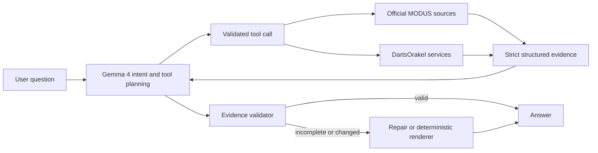

# Local darts chatbot manual

This manual explains how to install, start, use, verify, troubleshoot, and extend the local Ollama + Gemma 4 darts chatbot. The application combines a language model with deterministic data tools. Gemma understands questions and writes explanations; TypeScript code fetches and validates the facts.

## 1. What the application does

The chatbot supports two evidence paths:

1. **Official MODUS Super Series results** for today/current/latest MODUS questions.
2. **DartsOrakel player history** for PDC players and explicitly requested last-N match research.

For a prompt such as:

```text
today darts modus all matches and player averages
```

the application makes one bulk `getModusResults` tool call. It returns:

- every match in the official daily MODUS feed;
- match status and score;
- each player's official three-dart average for that individual match;
- the separate official cumulative weekly average table;
- the official feed timestamp and source URLs.

It does **not** replace current MODUS results with older DartsOrakel rows.

## 2. Quick start

### Requirements

- Windows, macOS, or Linux;
- Node.js 18 or newer;
- npm;
- Ollama installed and running;
- enough RAM/VRAM for `gemma4:12b` (the local model download is several GB);
- internet access for the public darts sources.

### First installation

Open PowerShell in the project directory:

```powershell
cd C:\Users\KomPhone\Desktop\ProjectFolder\dartsscraper
npm install
ollama pull gemma4:12b
```

Confirm that Ollama can see the model:

```powershell
ollama list
```

If the Ollama desktop application is not already running, start it or run:

```powershell
ollama serve
```

Use a second terminal for the chatbot:

```powershell
npm run chat
```

Open [http://127.0.0.1:3210](http://127.0.0.1:3210). Wait until the header says **Ollama ready**.

### Stop the application

Press `Ctrl+C` in the terminal that runs `npm run chat`. Ollama can remain running for future sessions.

## 3. How a question is answered



Gemma is genuinely involved. It:

- understands English or Hungarian wording;
- identifies the requested scope;
- chooses tools for ordinary darts research;
- resolves follow-up references from bounded chat history;
- organizes and explains validated evidence;
- answers conceptual questions when no current fact lookup is needed.

Gemma is not trusted to scrape HTML, invent a result, or calculate an official statistic. Tool arguments and results are schema-validated. Current MODUS result intent also has a deterministic routing guard, so a mistaken model plan cannot fan out to old per-player DartsOrakel averages.

## 4. Data-source selection

| Question | Primary source | Tool |
|---|---|---|
| Today's/latest MODUS matches, scores, or match averages | Official MODUS daily JSON | `getModusResults` |
| Official MODUS cumulative weekly averages | Official MODUS weekly averages page | `getModusResults` |
| MODUS participants/fixtures when result data is not requested | Official fixture source, then permitted fallback | `getModusPlayers` |
| Rob Cross/PDC/latest completed player matches | DartsOrakel | `getPlayerMatches` |
| Explicit last-N player average | DartsOrakel plus deterministic arithmetic | `getPlayerMatchAverage` |

Official pages used by the result tool:

- [daily MODUS feed](https://modussuperseries.com/live-scores-json.php)
- [MODUS results context](https://modussuperseries.com/results.php)
- the exact `week-averages.php?series_id=...&week_id=...` link discovered from the results page

The daily feed is used for the date, scores, statuses, and per-match averages. The results page supplies the selected series/week/group IDs. The weekly page supplies official cumulative totals. The normal production path uses three bulk requests and does not crawl every match-detail page.

Before accepting the weekly table, the adapter verifies that the results page's complete fixture-card matchup set matches the daily feed. A stale or unrelated week therefore fails closed instead of being attached to current matches.

## 5. The three meanings of “average”

The chatbot deliberately keeps these statistics separate:

### Match average

One player's official three-dart average in one match. Example: Jack Drayton recorded `91.58` in a particular match.

### Cumulative weekly average

The official MODUS total across the selected week. It is validated as:

```text
(total points / total darts) * 3
```

This is not calculated by averaging the displayed match averages.

### DartsOrakel last-N mean

The arithmetic mean of the match-average values in the latest N completed DartsOrakel rows. This is historical form, not an official same-day MODUS total.

## 6. Recommended prompts

### Current MODUS

```text
Today MODUS: list all matches, scores, both match averages, and the cumulative weekly averages.
Latest MODUS results and overall averages.
Mai MODUS meccsek, eredmények, meccsátlagok és heti összesített átlagok.
```

Expected answer sections:

1. official date, series, week, and group;
2. one row per daily match;
3. two separate per-match averages per completed match;
4. cumulative weekly table;
5. feed generation timestamp and source links.

### PDC/DartsOrakel player history

```text
Show Rob Cross's last 10 completed matches and mean match average.
Who did Rob Cross play most recently and what was his average?
Mutasd Rob Cross utolsó 20 meccsét és az átlagát.
```

### Explicit historical MODUS form

If you really want DartsOrakel history rather than today's official MODUS slate, say so explicitly:

```text
Using DartsOrakel, show Berry Van Peer's last 10 completed matches across events.
```

### Follow-up questions

The browser retains up to 20 recent user/assistant messages for the active session. You can ask:

```text
Which of those matches had the highest average?
Now show that player's last 10 DartsOrakel matches.
Explain the difference between the match average and weekly average.
```

Factual follow-ups are revalidated with tools; previous assistant prose is context, not evidence.

## 7. Browser controls

- **Send** submits the question.
- **Stop** cancels the current generation.
- **Clear conversation** creates a clean session and removes visible history.
- The status badge reports whether Ollama and `gemma4:12b` are ready.
- Long result tables scroll horizontally on small screens.
- Assistant formatting is rendered with safe DOM operations; source content is never inserted with `innerHTML`.

Only one browser generation is accepted at a time by default. A second simultaneous request receives backpressure instead of starting an unbounded model job.

## 8. Terminal usage

### One-shot research agent

```powershell
npm run agent -- "today MODUS all matches and player averages"
npm run agent -- "Show Rob Cross's last 10 matches and average"
```

Use debug mode to see tool names, arguments, durations, and status codes:

```powershell
npm run agent -- --debug "latest MODUS results and overall averages"
```

Debug output does not include hidden model reasoning.

### Interactive terminal agent

```powershell
npm run agent
```

Type questions at the `darts>` prompt. Type `exit` or `quit` to finish.

### Direct DartsOrakel scraper

```powershell
npm run player -- "Rob Cross" 10
npm run player -- "Rob Cross" 10 --json
```

This bypasses Gemma and directly runs the deterministic player scraper.

## 9. Configuration

Defaults:

```text
OLLAMA_MODEL=gemma4:12b
OLLAMA_BASE_URL=http://127.0.0.1:11434
CHAT_HOST=127.0.0.1
CHAT_PORT=3210
```

The application reads shell environment variables. It does not automatically load `.env`.

Example PowerShell override:

```powershell
$env:OLLAMA_MODEL = "gemma4:12b"
$env:OLLAMA_BASE_URL = "http://127.0.0.1:11434"
$env:CHAT_HOST = "127.0.0.1"
$env:CHAT_PORT = "3210"
npm run chat
```

Keep `CHAT_HOST=127.0.0.1`. The app has no user authentication and is designed for local use. Do not expose it to a LAN or the public internet without adding authentication, TLS, rate limits, and network controls.

## 10. Caching and freshness

| Directory | Data | Typical freshness |
|---|---|---|
| `.cache/modus-results` | Official result snapshot | 15 seconds |
| `.cache/modus` | MODUS participant discovery | 30 seconds for today; 6 hours for other dates |
| `.cache/dartsorakel` | Player directory and completed match pages | source-specific, longer lived |

The daily official request itself uses `cache: no-store`. The short local result cache prevents duplicate requests from rapid repeated questions while remaining suitable for live play.

To force a complete refresh, stop the chatbot and delete only the relevant cache directory. This is normally unnecessary.

## 11. Failure behavior

The app fails explicitly instead of silently substituting a different metric.

- **Official feed date mismatch:** the requested date is not the date currently published by the daily feed.
- **Official structure changed:** the source parser reports the URL and failed contract.
- **Daily/results context mismatch:** weekly averages are withheld because the selected results page could not be proven to match the daily slate.
- **Missing live average:** the value remains unavailable (`—`); it is not copied from DartsOrakel.
- **Ollama unavailable:** start Ollama and verify `http://127.0.0.1:11434`.
- **Model missing:** run `ollama pull gemma4:12b` and restart the chatbot.
- **Port already used:** stop the old process or set another `CHAT_PORT`.
- **Slow first answer:** the model may be loading into memory. Later prompts are usually faster.

Useful checks:

```powershell
ollama list
ollama ps
npm run build
npm test
npm run audit:prod
```

## 12. Privacy and security

- Gemma inference runs through the local Ollama server.
- Chat history is in process memory and expires after six hours of inactivity.
- Restarting the chatbot clears backend conversation sessions.
- Darts questions and source requests leave the machine only when public darts websites are queried.
- No API key is required for the current sources.
- Inputs, tool arguments, source payloads, and model protocol messages are bounded and validated.
- The local HTTP server uses same-origin checks and restrictive security headers.

## 13. Limits

- The official daily JSON is authoritative for the currently published date, not an arbitrary historical archive.
- An explicit historical date that no longer matches the daily feed produces an error rather than older substituted statistics.
- Website structure can change; parsers intentionally fail loudly so incorrect values are not accepted.
- The model can answer broader darts questions only when existing tools provide the required facts.
- It is not a general unrestricted web-search agent.

## 14. How to extend the chatbot

To add another kind of question safely:

1. define a strict input schema and output schema;
2. implement a source adapter with timeout and actionable errors;
3. add a deterministic service for parsing/calculation/caching;
4. register one focused tool in `src/agent/tools.ts`;
5. teach the system prompt when that tool is authoritative;
6. add evidence validation for high-risk numeric answers;
7. add fixtures and failure tests;
8. run the prompt through Ollama and the browser.

Examples of useful future tools are head-to-head summaries, rankings, tournament schedules, checkout distributions, and form trends. Gemma can then combine those structured facts to solve new related questions without hardcoding one exact prompt.

## 15. Developer file map

| File | Responsibility |
|---|---|
| `src/agent/harness.ts` | bounded Gemma loop, routing guards, evidence validation |
| `src/agent/tools.ts` | tool definitions and validated execution |
| `src/modus/official-results-source.ts` | official JSON/HTML adapters and parsers |
| `src/modus/results-schemas.ts` | strict official result snapshot schemas |
| `src/modus/results-service.ts` | 15-second validated cache |
| `src/services/player-matches.ts` | DartsOrakel match service |
| `src/chat/server.ts` | local browser HTTP/API server |
| `public/app.js` | browser interaction and safe answer rendering |
| `tests/modus-results.test.ts` | official source/parser/cache regression tests |
| `tests/agent-harness.test.ts` | tool-routing and evidence-guard tests |

The implementation and acceptance plan is in [`docs/MODUS_OPTIMIZATION_PLAN.md`](docs/MODUS_OPTIMIZATION_PLAN.md).
